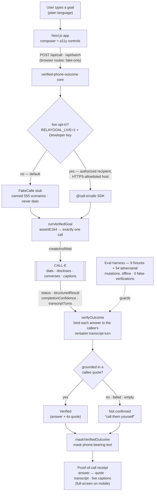

# RelayGoal

**For people who can't use the phone.** Type the goal; a CALL-E agent makes the whole call; you get back a captioned transcript and a **verified result** in which every answer is bound to the exact words the other party said, or is honestly marked *not confirmed, call them yourself*.

Built for Deaf, hard-of-hearing and speech-disabled callers, and for the advocates and agencies who make calls on their behalf today by hand. The user is never on the line. RelayGoal is a communication-support / task-assistant tool — **not** a telecommunications relay service (TRS) and **not** an interpreter replacement.

*The same verified-call engine works for anyone making a routine call they'd rather not — confirming an order, comparing vendor quotes — but RelayGoal leads with the people who have no other way to make the call at all.*

- **Live no-login demo:** https://call-e-2026.vercel.app (dry-run path, no key needed, fictional numbers only)
- **Runtime:** TypeScript · Next.js 15 · `@call-e/calle` 0.7 server SDK (optional, live path)
- **Status:** dry-run by default; live path verified with a real CALL-E call on 2026-09-11 (below)

## Why this exists

Every relay available to a Deaf caller today is *synchronous*: with a captioned-telephone app or FCC-funded TRS you still sit on the live call. Advocates and family members fill the gap by making calls on someone's behalf and reporting back. RelayGoal automates that hand-off and adds the thing a person who could not hear the call most needs: **proof of what was actually said**, not a summary to take on trust. A 2026 Censuswide survey for Rogervoice found 60% of US adults say phone calls are still not accessible to Deaf and hard-of-hearing people, and roughly three in four have avoided a call at least once.

## What it does

1. **Type the goal** in plain language ("Ask the pharmacy if my metformin refill is ready and when they close").
2. **The agent calls.** CALL-E places one outbound call, discloses that it is an assistant calling on someone's behalf, holds the conversation, works through phone menus, and returns `structured_result`, `completion_confidence`, `evidence` and `transcript_turns`.
3. **You get proof.** The verifier grounds every requested answer in the other party's own transcript turns. Each field is **Verified** (with the exact quote and the matched span highlighted) or **Not confirmed** (with the reason). Anything that cannot be grounded fails closed. The card also shows *whether the agent actually disclosed itself*, found in its own transcript turns.
4. **Compare places** (batch mode): one goal across N recipients, reconciled so a place is recommended only when its gating fact **and** its comparison value are both verified.

### The honesty rules (what "verified" means here)

- Only the **other party's** words can ground an answer. The agent's own turns never self-verify.
- `completion_confidence` is one gate, never the proof. **No confidence percentage is shown to the user.**
- Failed, canceled, no-answer, empty-transcript, task-not-completed, or ungrounded → **not confirmed**, with "call them yourself" and the number.
- The proof is a verbatim transcript turn; the UI highlights the matched span inside it so the user can check the binding themselves.

## Evidence

### Live call (real CALL-E, 2026-09-11)

One outbound call was placed through the exact production code path (`loadLiveCalle → runVerifiedGoal → verifyOutcome`, `test/live-smoke.test.ts`) to CALL-E's official US test hotline:

| | |
|---|---|
| Duration to terminal result | 101 s |
| Call status / task completed | `completed` / `true` |
| Requested fields | 2 (`line_purpose`, `hours`) |
| Verified | **2 of 2**, each bound to a verbatim turn spoken by the other party |
| AI disclosure | found at 0:03 in the agent's own turn: *"I'm an assistant calling on behalf of someone who is Deaf"* |

The raw outcome is kept outside the repository; no live transcript is committed.

### Measured on the fixture set (`npm run eval`, zero calls)

> **Precision:** 0 false verifications and 0 unsound quotes across 9 fixture calls (19 answer fields) + 54 adversarial mutations (114 fields). **Recall:** 14 of 14 answers the other party actually stated were marked verified. **Honest limit:** with two answers in one sentence, swapping their values was caught 3 of 17 times — quote grounding cannot separate two facts inside one sentence, so the card shows the quote for the user to check, never a confidence score.

The six mutations are: fabricated value, transcript dropped, task not completed, confidence collapsed, supporting sentence moved into the agent's mouth, call failed. The swap limit is reported deliberately: it is the honest boundary of transcript-quote grounding, and the reason the card shows the quote rather than asking for trust.

## Run it

```bash
npm install          # @call-e/calle is an optional dependency; the app runs without it
npm run dev          # http://localhost:3000 — dry-run FakeCalle path, no key, no calls
npm test             # 38 credential-free tests (core, phone, verify, batch, live-adapter mapping, disclosure, eval)
npm run eval         # prints the measured line above
npm run typecheck && npm run build
```

### Going live (explicit double opt-in)

The app **places no calls unless both** `RELAYGOAL_LIVE=1` **and** `CALLE_API_KEY` are set. A key in the environment alone never dials.

```bash
cp .env.example .env         # then paste a Developer API key (production keys start with iams_live_)
set -a; . ./.env; set +a
RELAYGOAL_LIVE=1 npm run dev # the same UI, now placing one real call per submitted goal
RELAYGOAL_LIVE=1 npx vitest run test/live-smoke.test.ts   # one call to the US test hotline; outcome written outside the repo
```

Get a key at https://dashboard.heycall-e.com/account/api-keys. Calls use CALL-E's shared number pool, which the sponsor designates for development and testing; production use needs your own KYC-verified number.

## Architecture



`completion_confidence` is only ever a gate into the Verified/Not-confirmed decision — it is never shown to the user; the proof is the quote. File map:

```
src/core/            the reusable verified-phone-outcome core (framework-free, fully unit-tested)
  types.ts           CalleLike — the one interface both clients implement
  fakecalle.ts       dry-run client replaying fixtures (default)
  livecalle.ts       @call-e/calle adapter: nested recipient, options-arg idempotency key,
                     per-attempt transcripts, nullable fields mapped conservatively
  runGoal.ts         validate E.164 → one call → verify; never retries a dial
  verify.ts          the honesty engine: callee-only grounding, confidence as a gate, fail-closed
  batch.ts           N recipients → reconciled ranking that recommends only verified winners
  disclosure.ts      did the agent disclose itself? (grounded in its own turns)
  eval.ts            the zero-cost adversarial harness behind the measured number
  phone.ts           strict E.164 + masking
src/goals.ts         goal presets: result_schema + requested keys, per vertical
app/api/call, batch  server routes; choose FakeCalle or live by the double opt-in
components/          composer · status timeline with live captions · verified-result card ·
                     evidence quote · transcript · comparison cards · display controls
```

Two verticals run on the one core with only a schema and framing swapped: the accessibility relay (flagship) and civic-office logistics (hours, documents, wait times; identity-walled facts come back *not confirmed* by design).

## Safety and side effects

| Requirement | Where |
|---|---|
| Canned destinations are fake-only | the browser routes (`app/api/call`, `app/api/batch`) **always** run `FakeCalle` and never dial, regardless of env — their presets are reserved-fictional 555 numbers |
| Real calling needs an authorized recipient | live dialing lives only in the server-side opt-in path (`selectCalleClient` / `loadLiveCalle`, exercised by `test/live-smoke.test.ts`), which requires `RELAYGOAL_LIVE=1` + `CALLE_API_KEY` and targets an explicitly authorized recipient; it is not reachable from the public unauthenticated routes |
| Credentials only to approved HTTPS | `assertApprovedBaseUrl` refuses to construct the client unless `CALLE_BASE_URL` is HTTPS on an approved CALL-E host (`api.heycall-e.com` / `test-api.heycall-e.com`) |
| Strict E.164 before any dial | `assertE164` runs first in `runVerifiedGoal` and for every batch recipient |
| Masked phone output | `maskPhone` on every recipient number **and** `maskPhonesInText` over transcript / evidence / result / summary text after verification (`maskVerifiedOutcome` at the route boundary) |
| Calls continue after you leave | once a call is accepted it runs to completion on CALL-E's side even if the request times out or the browser closes; the UI does not cancel it (stated in the composer) |
| Duplicate / ambiguous-outcome stopping | payload-bound idempotency key in SDK request options; no dial retry on client timeout; ambiguous → not confirmed |
| Fail-closed | failed / canceled / no answer / empty transcript / ungrounded → not confirmed with "call them yourself" |
| AI disclosure | mandated in the task template and **checked against the transcript** on every card |
| High-stakes boundaries | demo goals are non-PHI logistics (hours, availability, status, simple reschedule); no medical, legal, financial, insurance or emergency advice |
| Credentials | server-side env only; `.env` ignored; `.env.example` carries placeholders |
| Fictional numbers | every fixture uses reserved 555-01xx numbers; the live test targets the sponsor's own hotline |
| Cancellation | single-shot calls only; no recurring jobs |

## Accessibility of the app itself

Targets **WCAG 2.2 AA**. Geist body type with a Fraunces display face (17px base, 1.6 line-height); visible 3px focus rings and a skip link; `aria-live` live captions during the call; verification states carried by **icon + shape + text, never colour alone** (colourblind-safe — verified / blue, not-confirmed / amber, unreachable / red); a warm-obsidian default theme plus a warm-bone light theme and a dedicated high-contrast mode; text-size (17 / 19 / 21 px) and reduced-motion controls; fully keyboard-operable evidence links and display toggles.

**Installable, phone-native.** RelayGoal is a PWA (web app manifest + service worker + offline shell) that installs to the home screen and opens standalone. On a phone the live call **takes over the whole screen** — a voice-made-visible waveform and large, high-contrast captions of the other party's words, so the call lives where calls live and every word is readable without ever being heard. Desktop keeps the inline call timeline.

## Upstream contributions

Filed to CALL-E while building on it:

- **Submission** — RelayGoal in the awesome-list (this app, under `apps/typescript/relaygoal/`): [awesome-phone-call-agents#599](https://github.com/CALLE-AI/awesome-phone-call-agents/pull/599)
- **[calle-docs#56](https://github.com/CALLE-AI/calle-docs/pull/56)** — the Goal Run create (`201`) example showed `in_progress` for an undialed run (`call_id: null`); fixed to `queued` to match the OpenAPI `acceptedDeliveryConfirmation` example and the `GoalRunStatus` enum.
- **[server-sdk-typescript#25](https://github.com/CALLE-AI/server-sdk-typescript/pull/25)** — the Quickstart README's `calle_test_key` placeholder contradicted the documented `iams_live_` key prefix (a wrong-prefix key returns a `401` identical to a missing one); aligned it with the Authentication guide.

## Links

Live demo: https://call-e-2026.vercel.app · Demo video: https://youtu.be/WOpTlcSZ6io · Devpost: https://devpost.com/software/relaygoal

## License

MIT
